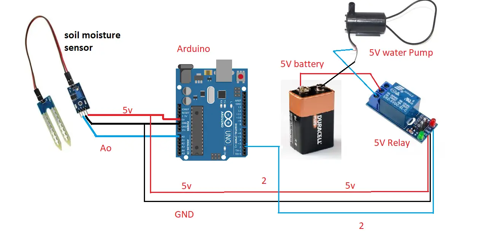

<h1> Automatic Irrigation System </h1>

An automated model that measures soil moisture levels via a soil moisture sensor and if the value obtained is below a certain
threshold, it waters the plant. Model does this check every 10 seconds. 

Watch the model in action in the "automatic irrigation.mp4" file.

<h3> Components Used </h3>
<ul>
    <li> Arduino </li>
    <li> Soil moisture sensor </li>
    <li> 5V relay module </li>
    <li> 5V Water Pump </li>
    <li> Water tube </li>
    <li> Jumper wires </li>
    <li> Battery </li>
</ul>

<h3> Circuit Diagram </h3>

